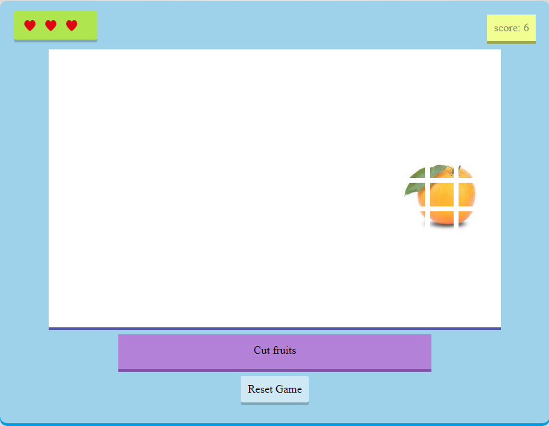

# fruit_game
<h3>Description</h3>
<h5>A basic fruit cutting web app dsigned using JQuery library for Javascript</h5>
<h5>Try it here - <a href="https://yavarmish.github.io/fruit_game/">Play</a></h5>

